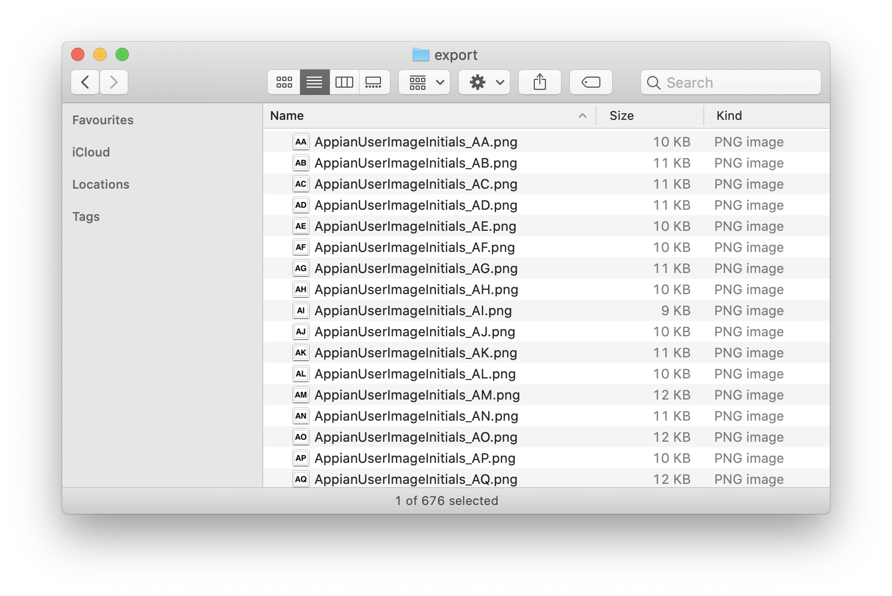

# Appian User Initials Avatars
Photoshop script used to generate avatars for use as profile images.

  

## Requirements
* Adobe Photoshop 2020 (_Not tested on previous versions of Photoshop_)

## Usage
1. Launch Photoshop
2. From the file menu, navigate to `File > Scripts > Browse...`
3. Navigate to the `src` directory in repo and select the `Generate Appian Initials Avatars.jsx` file
4. Template and exported files are output to the `Appian User Images` directory at `~/Desktop`

## Configuration
The following constants can be modified to customize the outputted images:
* CANVAS_SIZE
* BACKGROUND_COLOR
* TEXT_COLOR
* TEXT_FONT
* TEXT_SIZE