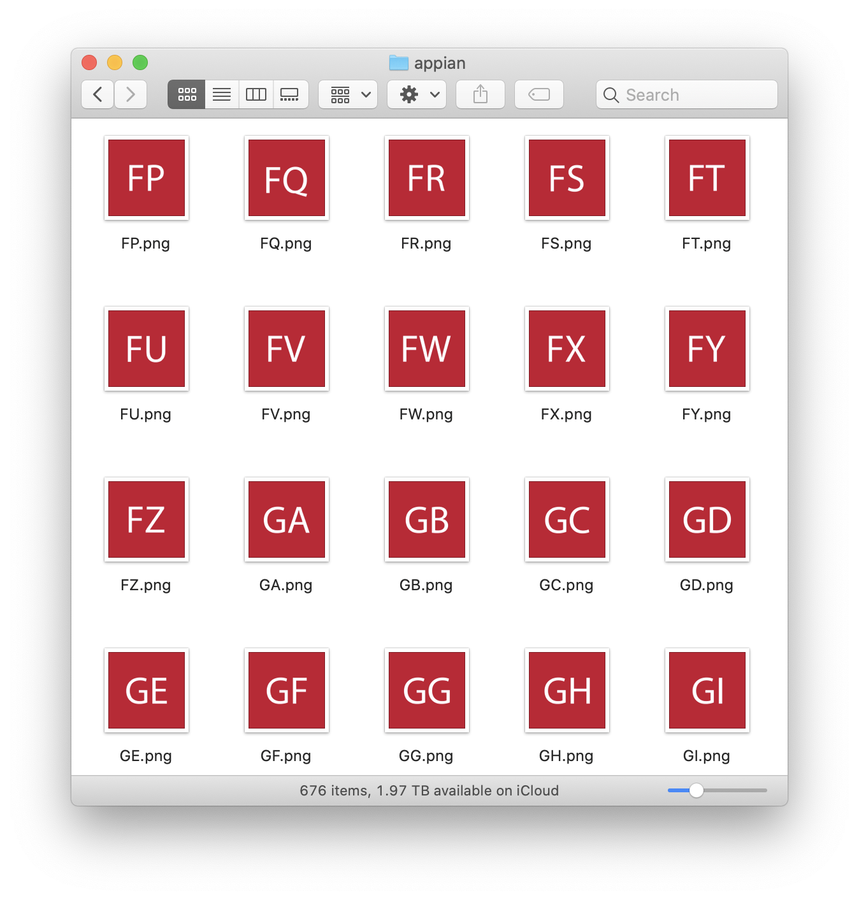

# Appian User Initials Profile Images
Photoshop Script and Action used to generate Appian user profile images.

## Requirements
* Adobe Photoshop 2020

## Installation
1. Launch Photoshop
2. Navigate to `resources/actions` directory in repo
3. Double-click on each action file (.atn)
4. Confirm that `Appian Profile Image Initials.atn` exists in Photoshop's Actions menu

## Usage
1. Launch Photoshop
2. From the file menu, navigate to `File > Scripts > Browse...`
3. Navigate to the `src` directory in repo and select the `Generate Profile Images.jsx` file
4. Template and exported files are output to the `Appian User Images` directory at `~/Desktop`